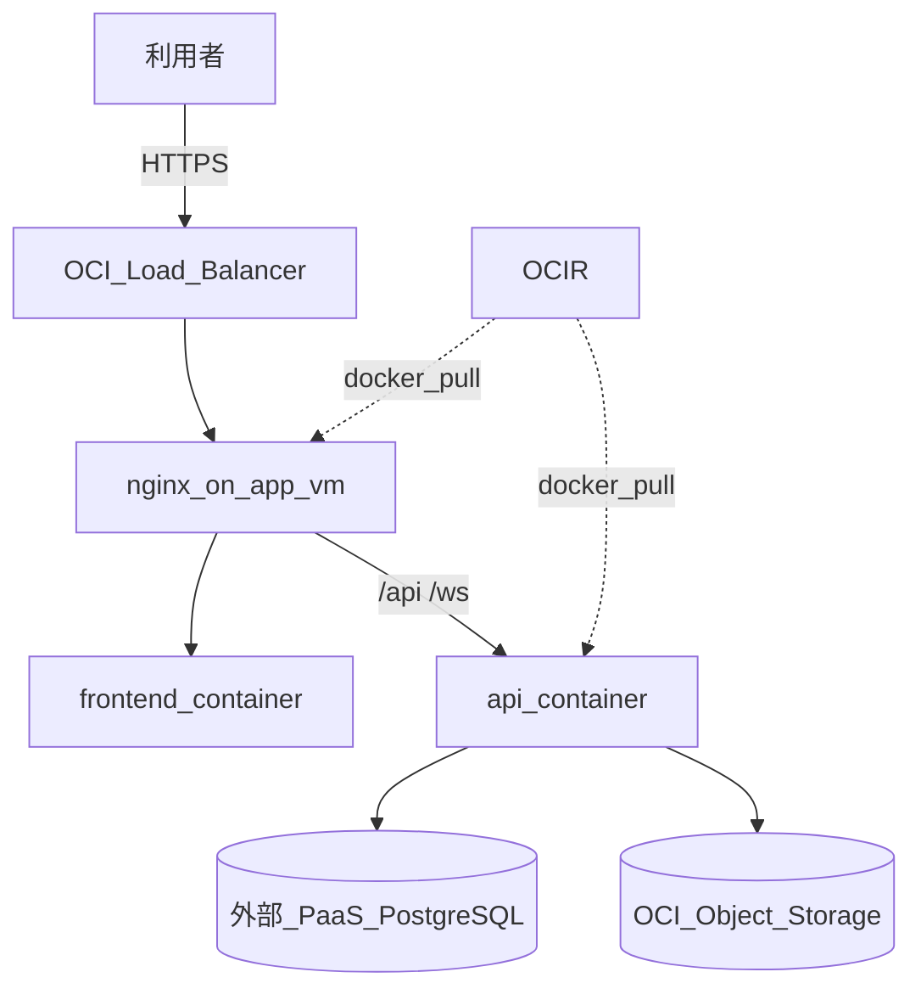

# イベント管理アプリ

複数ユーザーが同じイベントを共同で編集・閲覧し、コメントや参加表明をリアルタイムに同期できる Web アプリケーションです。  
認証・認可を前提とし、イベント画像は OCI Object Storage に保存します。本番は **OCI Always Free**（大阪リージョン）上に Load Balancer + Compute（Docker）+ OCIR + Object Storage で構成します。

## ドキュメント

| ドキュメント | 内容 |
| --- | --- |
| [01 機能要件](docs/01-functional-requirements.md) | 目的、機能一覧、制約、対象外 |
| [02 非機能要件](docs/02-non-functional-requirements.md) | 性能、セキュリティ、運用、環境 |
| [03 ユースケース](docs/03-use-cases.md) | アクター、シナリオ、代替フロー |
| [04 画面遷移](docs/04-screen-transitions.md) | 画面 ID、パス、遷移図 |
| [05 データモデル](docs/05-data-model.md) | ER 図、テーブル定義、DDL |
| [06 API](docs/06-api.md) | REST / WebSocket、認証、エラー |
| [07 アーキテクチャ](docs/07-architecture.md) | アプリ構成 + OCI インフラ（LB、Docker、OCIR、cron、Terraform） |
| [08 開発ガイド](docs/08-development-guide.md) | 垂直スライス、TDD、テスト戦略 |

> プロトタイプ（`prototype/`）で確定した UI 仕様は [01 機能要件 §6](docs/01-functional-requirements.md#6-検索フィルタイベント一覧)・[04 画面遷移](docs/04-screen-transitions.md) に反映済み。

## 技術スタック

| 層 | 採用 | 役割 |
| --- | --- | --- |
| フロントエンド | TypeScript / SolidJS / @solidjs/router | SPA、ルーティング、入力チェック、API・WebSocket |
| 状態管理 | createResource + WebSocket フック | サーバー状態の取得、イベント詳細のリアルタイム反映 |
| CSS | UnoCSS | ビルド時に最適化される原子 CSS |
| バックエンド | Python / FastAPI / Granian | REST API、WebSocket、バリデーション、認可 |
| ORM / マイグレーション | SQLAlchemy 2.0 / Alembic | スキーマ管理、型付きクエリ |
| データベース | PostgreSQL（ローカル: コンテナ / 本番: 外部 PaaS） | 複数ユーザー・同時書き込み向け RDB |
| オブジェクトストレージ | OCI Object Storage | イベント画像（S3 互換 API） |
| コンテナ | Docker / Docker Compose | ローカル・本番とも同一 compose 構成で起動 |
| コンテナレジストリ | OCI Container Registry（OCIR） | 本番イメージの保管・VM から pull |
| インフラ | OCI（Compute / LB / OCIR / Object Storage） | Always Free 枠での本番ホスティング |
| IaC | Terraform（hashicorp/oci） | VCN / Compute / LB / Bucket / OCIR のコード化 |

開発時の既定ポート: フロントエンド `localhost:5173`、バックエンド `localhost:8080`（`docker compose up` でも同じ）

## 技術選定の理由

### フロントエンド: SolidJS + @solidjs/router

画面と API を別プロセスに分けます。SolidJS は細粒度リアクティビティにより、イベント詳細のコメント一覧や参加状況など部分更新が多い UI で再描画コストを抑えられます。前回課題（recipe-app）で TanStack Start を使用済みのため、ルーティングは Solid 公式の `@solidjs/router` を採用します。イベント詳細では WebSocket で受信した差分を `createResource` のキャッシュと組み合わせて反映します。

### CSS: UnoCSS

ビルド時に使用クラスだけを抽出し、コンテナイメージ内の静的アセットを軽量に保ちます。

### バックエンド: Python（FastAPI + Granian）

課題要件としてバックエンド言語を Python に固定します。FastAPI は Pydantic 検証・OpenAPI 生成・WebSocket ネイティブサポートを兼ね備えます。同時接続が少ない（イベントあたりおおむね 10 人以下）前提では、ポーリングより **WebSocket** の方が無駄なリクエストが少なく、コメントや参加表明の反映も即時です。

### コンテナ: Docker Compose + OCIR

ローカルと本番で **同じ Docker Compose 定義** を使い、環境差を `.env` のみに閉じ込めます。本番 VM へはバイナリ直配置ではなく、CI または手元でビルドしたイメージを **OCI Container Registry** に push し、各 VM で `docker compose pull && up -d` します。プロセス管理は systemd 単体ではなく **Docker Compose がコンテナライフサイクルを担当** します。

### データベース: PostgreSQL（コンテナ）

ローカルでは Docker Compose 内の PostgreSQL コンテナを使います。本番では **外部 PaaS**（Neon / Supabase 等）に接続し、1 GB RAM の Micro VM 上で DB を同居させない構成とします（RDS 相当）。

### ストレージ: OCI Object Storage

画像バイナリを DB / コンテナイメージに含めず、Object Storage へ分離します。

### インフラ: OCI IaaS + Load Balancer + Terraform

AWS 無料枠は使い切り済みのため OCI Always Free を採用します。Compute は **E2.1.Micro 1 台**（EC2 相当）+ **外部 PostgreSQL**（RDS 相当）+ LB（ALB）+ Object Storage（S3）の構成です（[07 §3](docs/07-architecture.md)）。

## システム構成（概要）



- ブラウザ → Load Balancer → app-vm（Docker: nginx + frontend + api）→ 外部 PostgreSQL / Object Storage
- イベント詳細の他ユーザー更新は WebSocket（`/ws/events/{id}`）で配信

## 現状

- **VS-00 Walking Skeleton** — `backend/` + `frontend/` 骨格、health API、Alembic 初回マイグレーション、AppShell
- **設計ドキュメント**（`docs/01`〜`08`）
- **HTML/CSS/JS プロトタイプ**（`prototype/`）— UX 検証用。Docs と矛盾する場合は **プロトタイプを正** とする（一覧 UI・作成モーダル等）

## ローカル開発（VS-00）

### 前提

- Python 3.12+
- Node.js 20+
- PostgreSQL 16（例: `docker run -d --name event-pg -e POSTGRES_PASSWORD=postgres -e POSTGRES_DB=event_app -p 5433:5432 postgres:16`）

### バックエンド

```bash
cd backend
python3 -m pip install -e ".[dev]"
cp .env.example .env
alembic upgrade head
python3 -m granian --interface asgi app.main:app --host 0.0.0.0 --port 8080
```

### フロントエンド

```bash
cd frontend
npm install
cp .env.example .env
npm run dev
```

- FE: http://localhost:5173
- API health: http://localhost:8080/api/v1/health

### テスト

```bash
cd backend && python3 -m pytest
cd frontend && npm test
```

## OCI インフラ先行取得

app-vm（E2.1.Micro）/ LB / Object Storage を、アプリ完成前に Terraform で取得できます。  
手順は [infra/README.md](infra/README.md) を参照（recipe-app の `terraform.tfvars` を流用可）。

### プロトタイプの起動

```bash
cd prototype
python3 -m http.server 8765
# http://localhost:8765 を開く
```

デモアカウント: `alice@example.com` / `demo1234`

## 初級（recipe-app）との関係

初級も本アプリも **E2.1.Micro 1 台** 構成を想定しますが、**VM の引き継ぎ（移行）ではない**。初級を `terraform destroy` するのは x86 Micro 枠（最大 2 台）の整理と、同時公開を避けるため。本アプリ用 app-vm は **別途新規作成** し、DB は外部 PaaS を使います（[07 §3.1](docs/07-architecture.md)）。
