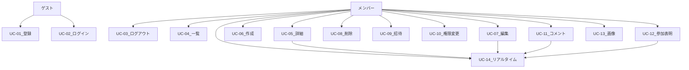

# ユースケース

## 1. アクター

| アクター | 説明 |
| --- | --- |
| ゲスト | 未ログインユーザー |
| メンバー | ログイン済みでイベントに参加しているユーザー |
| Owner | イベント作成者。招待・削除・権限管理が可能 |
| Editor | イベント内容の編集が可能 |
| Viewer | 閲覧・コメント・参加表明のみ |

## 2. ユースケース一覧

| ID | 名称 | 主アクター |
| --- | --- | --- |
| UC-01 | ユーザー登録 | ゲスト |
| UC-02 | ログイン | ゲスト |
| UC-03 | ログアウト | メンバー |
| UC-04 | イベント一覧表示 | メンバー |
| UC-05 | イベント詳細表示 | メンバー |
| UC-06 | イベント作成 | メンバー |
| UC-07 | イベント編集 | Owner / Editor |
| UC-08 | イベント削除 | Owner |
| UC-09 | メンバー招待 | Owner |
| UC-10 | メンバー権限変更 | Owner |
| UC-11 | コメント投稿 | メンバー（viewer 以上） |
| UC-12 | 参加表明 | メンバー |
| UC-13 | 画像アップロード | Owner / Editor |
| UC-14 | リアルタイム同期受信 | メンバー |

## 3. 関係図

## 4. 主要シナリオ

### UC-02 ログイン

**基本フロー**

1. ユーザーがメールとパスワードを入力する
2. システムが認証し、アクセストークンとリフレッシュトークンを返す
3. フロントがトークンを保存し、イベント一覧へ遷移する

**代替フロー**

- 2a. 認証失敗 → 422、フォームにエラー表示
- 2b. ネットワークエラー → トースト表示、再試行可能

### UC-04 イベント一覧表示

**基本フロー**

1. メンバーがイベント一覧（S-03）を開く
2. 既定は **カレンダー（月表示）**。自分が関与するイベントが日付セルに表示される
3. ツールバーで **スケジュール** タブに切替えると、24h タイムライン（最大 7 日間）で表示される
4. ロールフィルタ（すべて / owner / member）で絞り込める
5. イベントチップまたはタイムラインブロックから詳細へ遷移する

**代替フロー**

- 3a. スケジュールで期間（from / to）を変更 → URL と表示が同期
- 4a. カレンダーで同日 3 件以上 → セルに 2 件 +「他 N 件」。クリックで当日一覧モーダル
- 5a. 空の日付セルをクリック → 新規作成モーダル（その日 10:00–12:00 を既定）

### UC-06 イベント作成

**基本フロー**

1. メンバーが一覧の **+ 新規作成**（またはカレンダー上の日付操作）で **モーダル** を開く
2. 必須項目を入力する（任意で画像 URL / 本番ではアップロード）
3. 送信すると API が Event と owner メンバー行をトランザクションで作成する
4. 画像がある場合、API が Object Storage に PUT しキーを Event に保存する
5. モーダルを閉じ、**詳細画面**へ遷移する

**代替フロー**

- 3a. バリデーションエラー → 422、フィールド表示
- 3b. 画像アップロード失敗 → Event は作成済み、画像なしで詳細表示 + 警告
- 1a. キャンセル → モーダルを閉じ一覧に留まる（入力破棄）

### UC-07 イベント編集

**基本フロー**

1. Owner / Editor が詳細から編集画面を開く
2. 内容を変更して保存する
3. API が Event を更新し、WebSocket で `event.updated` を配信する
4. 同一イベント詳細を開いている他メンバーの画面が更新される
5. 編集者は詳細画面へ戻る

**代替フロー**

- 1a. Viewer が編集 URL に直接アクセス → 403
- 2a. キャンセル → 詳細へ（未保存確認）
- 3a. 404（削除済み）→ 一覧へ

### UC-09 メンバー招待

**基本フロー**

1. Owner が詳細画面で招待ダイアログを開く
2. 相手のメールアドレスとロール（editor / viewer）を指定する
3. API がユーザーを検索し EventMember を追加する
4. 招待されたユーザーは一覧にイベントが表示される

**代替フロー**

- 3a. ユーザー未登録 → 409「ユーザーが見つかりません」
- 3b. 既にメンバー → 409

### UC-11 コメント投稿

**基本フロー**

1. メンバーが詳細画面のコメント欄に入力する
2. 送信すると API がコメントを保存する
3. WebSocket で `comment.created` を配信する
4. 全メンバーのコメント一覧末尾に表示される

**代替フロー**

- 2a. 空文字 → 422
- 2a. 非メンバー → 404

### UC-14 リアルタイム同期受信

**基本フロー**

1. メンバーがイベント詳細を開く
2. フロントが WebSocket `/ws/events/{id}` に接続する（Bearer トークン付き）
3. 他ユーザーの `event.updated` / `comment.created` / `participation.updated` を受信し UI を更新する
4. タブ非表示中は接続を維持（切断時は指数バックオフで再接続）

**代替フロー**

- 2a. トークン無効 → 401、ログインへ
- 2b. 切断 → 自動再接続

## 5. ユースケースと機能 ID 対応

| ユースケース | 機能 ID |
| --- | --- |
| UC-01, UC-02, UC-03 | F-01, F-02 |
| UC-04 | F-03 |
| UC-05 | F-04 |
| UC-06 | F-05, F-13 |
| UC-07 | F-06, F-12 |
| UC-08 | F-07 |
| UC-09, UC-10 | F-08, F-09 |
| UC-11 | F-11, F-12 |
| UC-12 | F-10, F-12 |
| UC-13 | F-13 |
| UC-14 | F-12 |
