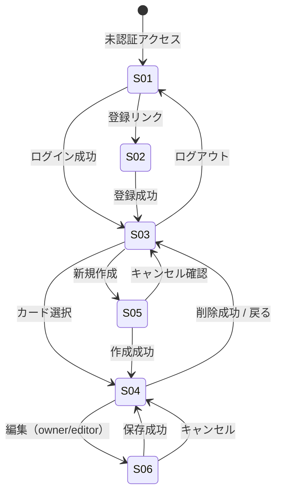

# 画面遷移

## 1. 画面一覧

| ID | 名称 | パス | 認証 | 主な操作 |
| --- | --- | --- | --- | --- |
| S-01 | ログイン | `/login` | 不要 | ログイン、登録リンク |
| S-02 | 新規登録 | `/register` | 不要 | アカウント作成 |
| S-03 | イベント一覧 | `/events` | 必要 | 検索、フィルタ、新規作成 |
| S-04 | イベント詳細 | `/events/$eventId` | 必要 | 編集、削除、招待、コメント、参加表明 |
| S-05 | イベント作成 | `/events/new` | 必要 | 作成、キャンセル |
| S-06 | イベント編集 | `/events/$eventId/edit` | 必要 | 保存、キャンセル、画像差し替え |

## 2. 遷移図



## 3. search params（S-03 一覧）

| パラメータ | 例 | 説明 |
| --- | --- | --- |
| q | `?q=勉強会` | キーワード |
| from | `?from=2026-09-01` | 開始日（以降） |
| to | `?to=2026-09-30` | 開始日（以前） |
| role | `?role=owner` | owner / member |
| sort | `?sort=updated_desc` | 並び順 |

## 4. ワイヤーフレーム（ASCII）

### S-03 イベント一覧

```
+--------------------------------------------------+
| [Logo] イベント管理          [ユーザー名 ▼]      |
+--------------------------------------------------+
| [キーワード____] [期間▼] [並び▼]    [+ 新規]    |
+--------------------------------------------------+
| +----------------+  +----------------+           |
| | 9/10 勉強会    |  | 9/15 懇親会    |           |
| | オンライン     |  | 大阪駅前       |           |
| | owner          |  | editor         |           |
| +----------------+  +----------------+           |
+--------------------------------------------------+
```

### S-04 イベント詳細

```
+--------------------------------------------------+
| ← 一覧    勉強会                    [編集][削除]|
+--------------------------------------------------+
| [画像]                                           |
| 2026/9/10 19:00 - 21:00  オンライン              |
| 説明文...                                        |
+--------------------------------------------------+
| 参加: [参加する][未定][不参加]  ← 参加表明       |
+--------------------------------------------------+
| メンバー (3)                    [+ 招待] owner のみ|
| - Alice (owner)  - Bob (editor)                  |
+--------------------------------------------------+
| コメント                                         |
| Bob: 資料持参します                              |
| [入力________________________] [送信]            |
+--------------------------------------------------+
```

## 5. ユースケース対応

| 画面 | ユースケース |
| --- | --- |
| S-01 | UC-02 |
| S-02 | UC-01 |
| S-03 | UC-04 |
| S-04 | UC-05, UC-08〜UC-12, UC-14 |
| S-05 | UC-06 |
| S-06 | UC-07, UC-13 |

## 6. 認証ガード

| パス | 未認証時 |
| --- | --- |
| `/events/*` | `/login` へ redirect（`redirect` param に元 URL） |
| `/login`, `/register` | 認証済みなら `/events` へ |

## 7. 権限に応じた UI

| 要素 | owner | editor | viewer |
| --- | --- | --- | --- |
| 編集ボタン | ○ | ○ | 非表示 |
| 削除ボタン | ○ | 非表示 | 非表示 |
| 招待ボタン | ○ | 非表示 | 非表示 |
| コメント入力 | ○ | ○ | ○ |
| 参加表明 | ○ | ○ | ○ |
