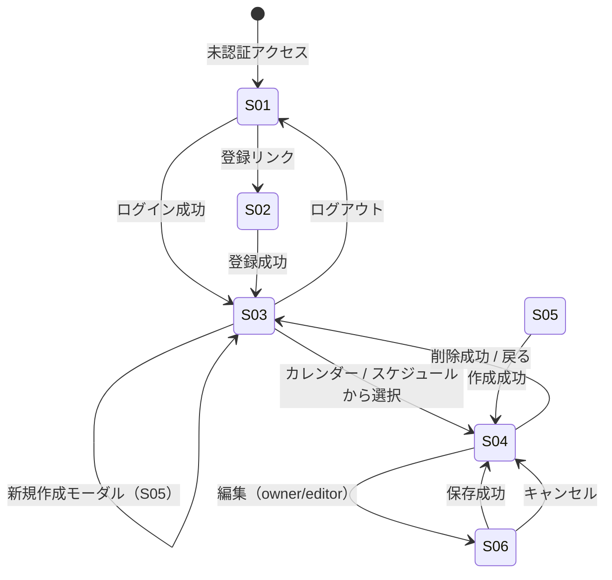

# 画面遷移

## 1. 画面一覧

| ID | 名称 | パス | 認証 | 主な操作 |
| --- | --- | --- | --- | --- |
| S-01 | ログイン | `/login` | 不要 | ログイン、登録リンク |
| S-02 | 新規登録 | `/register` | 不要 | アカウント作成 |
| S-03 | イベント一覧 | `/events` | 必要 | 表示切替（カレンダー / スケジュール）、ロールフィルタ、新規作成（モーダル） |
| S-04 | イベント詳細 | `/events/$eventId` | 必要 | 編集、削除、招待、コメント、参加表明 |
| S-05 | イベント作成（モーダル） | `/events`（`+ 新規作成` または `?create=1`） | 必要 | モーダルで作成、キャンセルで一覧に留まる |
| S-06 | イベント編集 | `/events/$eventId/edit` | 必要 | 保存、キャンセル、画像差し替え |

> `/events/new` は一覧へリダイレクトし、作成モーダルを開く（ブックマーク互換）。

## 2. 遷移図



> S-05 は S-03 上のモーダル。独立画面への遷移はしない。

## 3. search params（S-03 一覧）

| パラメータ | 例 | 説明 |
| --- | --- | --- |
| view | `?view=schedule` | `calendar`（既定）/ `schedule` |
| month | `?month=2026-09` | カレンダー表示月（`YYYY-MM`） |
| from | `?from=2026-09-01` | スケジュール表示開始日 |
| to | `?to=2026-09-07` | スケジュール表示終了日（最大 7 日間） |
| role | `?role=owner` | owner / member |
| create | `?create=1` | 一覧表示と同時に新規作成モーダルを開く（`/events/new` リダイレクト用） |

**採用しない**: `q`（キーワード検索）、一覧用 `sort` UI（API パラメータ `sort` は将来用に残す）。

### 3.1 表示例

| URL | 意味 |
| --- | --- |
| `#/events` | 当月カレンダー |
| `#/events?view=schedule&from=2026-09-10&to=2026-09-12` | 9/10–12 の 24h タイムライン |
| `#/events?role=member&month=2026-10` | 10 月カレンダー（招待イベントのみ） |

## 4. ワイヤーフレーム（ASCII）

### S-03 イベント一覧（カレンダー表示・既定）

```
+--------------------------------------------------+
| [Logo] イベント管理          [ユーザー名] [ログアウト]|
+--------------------------------------------------+
| [カレンダー|スケジュール] [ロール▼]  [+ 新規作成]   |
+--------------------------------------------------+
|        2026年9月              [今月] [←] [→]      |
+--------------------------------------------------+
| 日  月  火  水  木  金  土                        |
|     1   2   3   4   5   6                        |
|  7   8   9  10* 11  12  13                       |
|     ... 10:00 勉強会                             |
|         19:00 振り返り                           |
|         [他 1 件]                                |
+--------------------------------------------------+
```

### S-03 イベント一覧（スケジュール表示）

```
+--------------------------------------------------+
| [カレンダー|スケジュール] [ロール▼] [from][〜][to]|
+--------------------------------------------------+
| 9/10（水）〜 9/12（金）  [今日] [←] [→]           |
+--------------------------------------------------+
|     | 9/10      | 9/11      | 9/12               |
|00:00|           |           |                    |
| ... | [イベント]|           |                    |
| NOW |---赤線----|           |                    |
+--------------------------------------------------+
```

### S-05 イベント作成（モーダル — S-03 上に重ねる）

```
+--------------------------------------------------+
| 新規イベント                              [×]    |
| タイトル * [________________]                    |
| 説明     [________________]                      |
| 開始 *   [datetime]  終了 * [datetime]           |
| 場所     [________________]                      |
|              [キャンセル]  [作成]                |
+--------------------------------------------------+
```

### S-04 イベント詳細

```
+--------------------------------------------------+
| ← 一覧    勉強会                    [編集][削除]|
+--------------------------------------------------+
| [画像]                                           |
| 2026/9/10 19:00 - 21:00  オンライン              |
| 説明文...                                        |
+--------------------------------------------------+
| 参加: [参加する][未定][不参加]  ← 参加表明       |
+--------------------------------------------------+
| メンバー (3)                    [+ 招待] owner のみ|
| - Alice (owner)  - Bob (editor)                  |
+--------------------------------------------------+
| コメント                                         |
| Bob: 資料持参します                              |
| [入力________________________] [送信]            |
+--------------------------------------------------+
```

## 5. ユースケース対応

| 画面 | ユースケース |
| --- | --- |
| S-01 | UC-02 |
| S-02 | UC-01 |
| S-03 | UC-04 |
| S-04 | UC-05, UC-08〜UC-12, UC-14 |
| S-05 | UC-06 |
| S-06 | UC-07, UC-13 |

## 6. 認証ガード

| パス | 未認証時 |
| --- | --- |
| `/events/*` | `/login` へ redirect（`redirect` param に元 URL） |
| `/login`, `/register` | 認証済みなら `/events` へ |

## 7. 権限に応じた UI

| 要素 | owner | editor | viewer |
| --- | --- | --- | --- |
| 編集ボタン | ○ | ○ | 非表示 |
| 削除ボタン | ○ | 非表示 | 非表示 |
| 招待ボタン | ○ | 非表示 | 非表示 |
| コメント入力 | ○ | ○ | ○ |
| 参加表明 | ○ | ○ | ○ |
