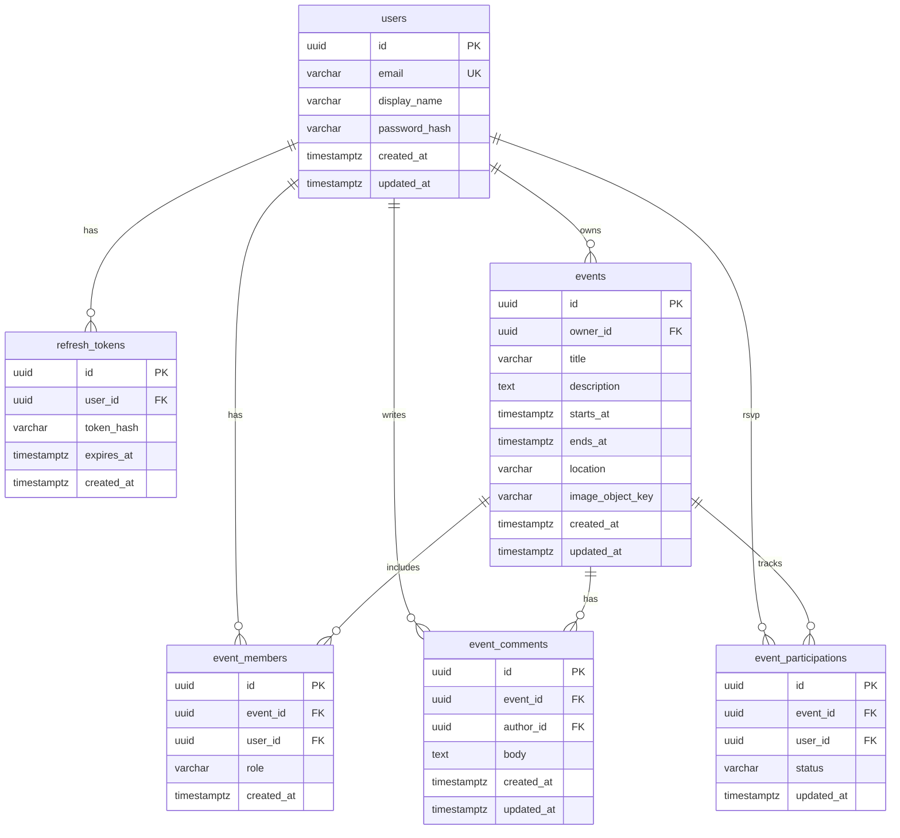

# データモデル

## 1. ER 図



**補足:** `event_members` の 1:N は「1 イベントに複数メンバー行」という意味。ユーザーは複数イベントに参加できる（多対多は中間テーブル `event_members` で表現）。

## 2. テーブル定義

### users

| カラム | 型 | 制約 |
| --- | --- | --- |
| id | UUID | PK, default gen_random_uuid() |
| email | VARCHAR(254) | NOT NULL, UNIQUE |
| display_name | VARCHAR(50) | NOT NULL |
| password_hash | VARCHAR(255) | NOT NULL |
| created_at | TIMESTAMPTZ | NOT NULL, default now() |
| updated_at | TIMESTAMPTZ | NOT NULL, default now() |

### events

| カラム | 型 | 制約 |
| --- | --- | --- |
| id | UUID | PK |
| owner_id | UUID | NOT NULL, FK → users(id) |
| title | VARCHAR(100) | NOT NULL |
| description | TEXT | NULL |
| starts_at | TIMESTAMPTZ | NOT NULL |
| ends_at | TIMESTAMPTZ | NOT NULL |
| location | VARCHAR(200) | NULL |
| image_object_key | VARCHAR(512) | NULL |
| created_at | TIMESTAMPTZ | NOT NULL |
| updated_at | TIMESTAMPTZ | NOT NULL |

CHECK: `ends_at >= starts_at`

### event_members

| カラム | 型 | 制約 |
| --- | --- | --- |
| id | UUID | PK |
| event_id | UUID | NOT NULL, FK → events(id) ON DELETE CASCADE |
| user_id | UUID | NOT NULL, FK → users(id) ON DELETE CASCADE |
| role | VARCHAR(20) | NOT NULL, CHECK (role IN ('owner','editor','viewer')) |
| created_at | TIMESTAMPTZ | NOT NULL |

UNIQUE (event_id, user_id)

### event_comments

| カラム | 型 | 制約 |
| --- | --- | --- |
| id | UUID | PK |
| event_id | UUID | NOT NULL, FK → events(id) ON DELETE CASCADE |
| author_id | UUID | NOT NULL, FK → users(id) |
| body | VARCHAR(500) | NOT NULL |
| created_at | TIMESTAMPTZ | NOT NULL |
| updated_at | TIMESTAMPTZ | NOT NULL |

### event_participations

| カラム | 型 | 制約 |
| --- | --- | --- |
| id | UUID | PK |
| event_id | UUID | NOT NULL, FK → events(id) ON DELETE CASCADE |
| user_id | UUID | NOT NULL, FK → users(id) ON DELETE CASCADE |
| status | VARCHAR(20) | NOT NULL, CHECK (status IN ('going','maybe','not_going')) |
| updated_at | TIMESTAMPTZ | NOT NULL |

UNIQUE (event_id, user_id)

### refresh_tokens

| カラム | 型 | 制約 |
| --- | --- | --- |
| id | UUID | PK |
| user_id | UUID | NOT NULL, FK → users(id) ON DELETE CASCADE |
| token_hash | VARCHAR(255) | NOT NULL |
| expires_at | TIMESTAMPTZ | NOT NULL |
| created_at | TIMESTAMPTZ | NOT NULL |

## 3. インデックス

| テーブル | インデックス | 用途 |
| --- | --- | --- |
| events | (owner_id) | 自分のイベント一覧 |
| events | (starts_at) | 期間フィルタ |
| event_members | (user_id) | 参加イベント一覧 |
| event_comments | (event_id, created_at) | コメント時系列 |
| refresh_tokens | (user_id) | ログアウト・失効 |

## 4. 参考 DDL

```sql
CREATE EXTENSION IF NOT EXISTS pgcrypto;

CREATE TABLE users (
  id UUID PRIMARY KEY DEFAULT gen_random_uuid(),
  email VARCHAR(254) NOT NULL UNIQUE,
  display_name VARCHAR(50) NOT NULL,
  password_hash VARCHAR(255) NOT NULL,
  created_at TIMESTAMPTZ NOT NULL DEFAULT now(),
  updated_at TIMESTAMPTZ NOT NULL DEFAULT now()
);

CREATE TABLE events (
  id UUID PRIMARY KEY DEFAULT gen_random_uuid(),
  owner_id UUID NOT NULL REFERENCES users(id),
  title VARCHAR(100) NOT NULL,
  description TEXT,
  starts_at TIMESTAMPTZ NOT NULL,
  ends_at TIMESTAMPTZ NOT NULL,
  location VARCHAR(200),
  image_object_key VARCHAR(512),
  created_at TIMESTAMPTZ NOT NULL DEFAULT now(),
  updated_at TIMESTAMPTZ NOT NULL DEFAULT now(),
  CHECK (ends_at >= starts_at)
);

CREATE TABLE event_members (
  id UUID PRIMARY KEY DEFAULT gen_random_uuid(),
  event_id UUID NOT NULL REFERENCES events(id) ON DELETE CASCADE,
  user_id UUID NOT NULL REFERENCES users(id) ON DELETE CASCADE,
  role VARCHAR(20) NOT NULL CHECK (role IN ('owner', 'editor', 'viewer')),
  created_at TIMESTAMPTZ NOT NULL DEFAULT now(),
  UNIQUE (event_id, user_id)
);

CREATE TABLE event_comments (
  id UUID PRIMARY KEY DEFAULT gen_random_uuid(),
  event_id UUID NOT NULL REFERENCES events(id) ON DELETE CASCADE,
  author_id UUID NOT NULL REFERENCES users(id),
  body VARCHAR(500) NOT NULL,
  created_at TIMESTAMPTZ NOT NULL DEFAULT now(),
  updated_at TIMESTAMPTZ NOT NULL DEFAULT now()
);

CREATE TABLE event_participations (
  id UUID PRIMARY KEY DEFAULT gen_random_uuid(),
  event_id UUID NOT NULL REFERENCES events(id) ON DELETE CASCADE,
  user_id UUID NOT NULL REFERENCES users(id) ON DELETE CASCADE,
  status VARCHAR(20) NOT NULL CHECK (status IN ('going', 'maybe', 'not_going')),
  updated_at TIMESTAMPTZ NOT NULL DEFAULT now(),
  UNIQUE (event_id, user_id)
);

CREATE TABLE refresh_tokens (
  id UUID PRIMARY KEY DEFAULT gen_random_uuid(),
  user_id UUID NOT NULL REFERENCES users(id) ON DELETE CASCADE,
  token_hash VARCHAR(255) NOT NULL,
  expires_at TIMESTAMPTZ NOT NULL,
  created_at TIMESTAMPTZ NOT NULL DEFAULT now()
);
```

## 5. トランザクション

| 操作 | トランザクション |
| --- | --- |
| ユーザー登録 | users INSERT |
| イベント作成 | events INSERT + event_members INSERT（owner） |
| イベント削除 | events DELETE（CASCADE）+ Object Storage DELETE（コミット後） |
| コメント投稿 | event_comments INSERT |
| RSVP | event_participations INSERT ... ON CONFLICT UPDATE |

## 6. Object Storage（DB 外）

| 項目 | 値 |
| --- | --- |
| バケット | `event-app-images-{env}` |
| キー形式 | `events/{event_id}/{uuid}.{ext}` |
| 公開 | バケットポリシーで読み取りのみ公開 |
| DB 保持 | `events.image_object_key` のみ |

## 7. 同時実行

PostgreSQL の行ロックとトランザクション分離（READ COMMITTED）を前提とする。同一イベントの同時 PATCH は後勝ち（last write wins）とし、WebSocket で最新状態を全クライアントへ配信して収束させる。

## 8. N+1 問題と対策

イベント・ユーザー・メンバー・コメント・参加表明の関連で、素朴な実装だと **N+1 クエリ** が起きうる。

### 8.1 起きうる箇所

| 画面 / API | 素朴な実装（問題） | クエリ数 |
| --- | --- | --- |
| イベント一覧 | events を 1 回取得 → 各 event の owner・参加集計をループ取得 | 1 + N |
| イベント詳細メンバー | members を 1 回 → 各 user の display_name を個別取得 | 1 + N |
| コメント一覧 | comments を 1 回 → 各 author を個別取得 | 1 + N |

### 8.2 設計上の対策

| 層 | 方針 |
| --- | --- |
| Repository | **JOIN** または SQLAlchemy **`selectinload` / `joinedload`** で関連を一括取得 |
| 一覧 API | 1 クエリ（または固定 2 クエリ）で DTO まで組み立てて返す |
| 詳細 API | members / comments は **user を JOIN 済み** で返す。フロントから user を追加取得しない |
| 集計 | 参加表明件数（going / maybe / not_going）は **サブクエリ + GROUP BY** または JOIN + 集約 |

**イベント一覧（例）:** `events` ⋈ `event_members`（自分の membership）⋈ `users`（owner）+ 参加集計をサブクエリ 1 本で付与 → **1 リクエスト 1〜2 SQL**。

**コメント一覧（例）:** `event_comments` ⋈ `users`（author）を `WHERE event_id = ? ORDER BY created_at` → **1 SQL**。

### 8.3 API レスポンス方針

- 一覧: `owner_display_name`, `participation_summary` を **イベントオブジェクトに埋め込み**（クライアントが user API を追加呼び出ししない）
- コメント: `author: { id, display_name }` を **コメントにネスト**（author_id だけ返さない）
- メンバー: `user: { id, email, display_name }` を **メンバー行にネスト**

### 8.4 ページネーション

コメント・一覧は **limit / offset（または cursor）** 必須。全件ロードによる N+1 とメモリ増大を防ぐ。

