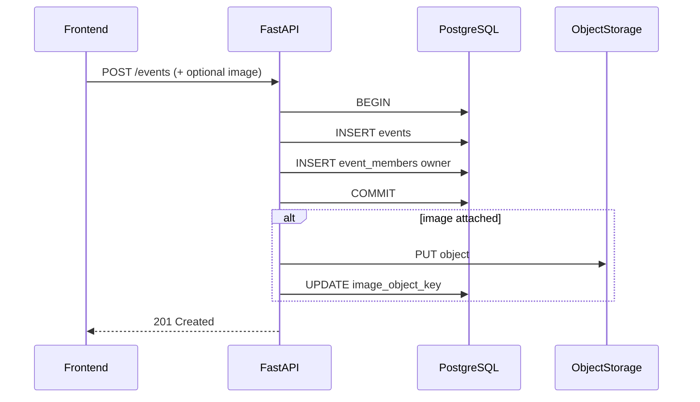
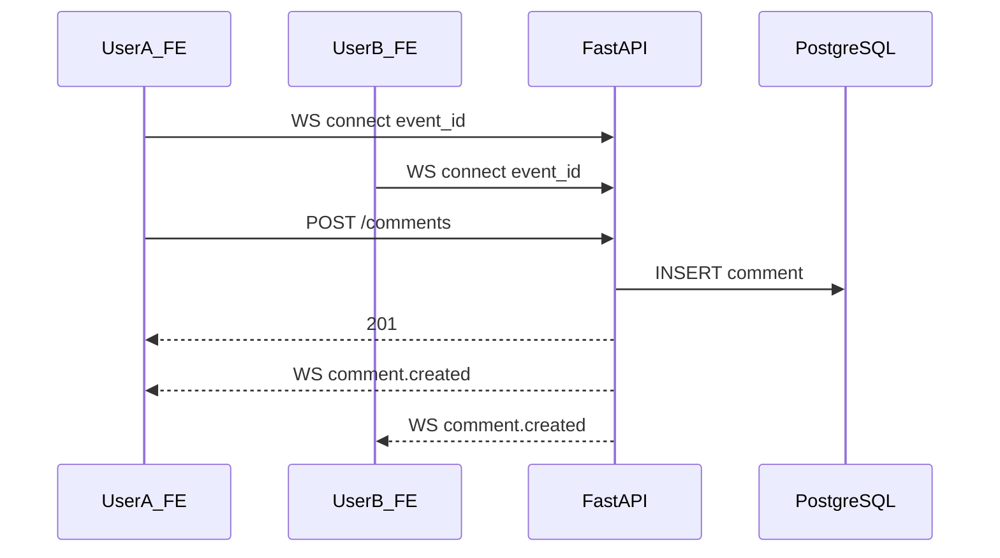

# API 設計

## 1. 概要

| 項目 | 内容 |
| --- | --- |
| ベース URL（開発） | `http://localhost:8080/api/v1` |
| ベース URL（本番） | `https://{domain}/api/v1`（nginx プロキシ） |
| 形式 | JSON（`Content-Type: application/json`） |
| 認証 | Bearer JWT（アクセストークン）。`/auth/*` を除く |
| WebSocket | `/ws/events/{event_id}`（接続時に Bearer トークンを付与） |

## 2. 認証

| エンドポイント | メソッド | 認証 | 説明 |
| --- | --- | --- | --- |
| `/auth/register` | POST | 不要 | ユーザー登録 |
| `/auth/login` | POST | 不要 | ログイン |
| `/auth/refresh` | POST | 不要（refresh token body） | アクセストークン再発行 |
| `/auth/logout` | POST | 必要 | リフレッシュトークン失効 |

**トークン仕様**

| 種別 | 有効期限 | 保存 |
| --- | --- | --- |
| アクセストークン | 15 分 | フロントメモリ / sessionStorage |
| リフレッシュトークン | 7 日 | HttpOnly Cookie または DB + body（実装時に決定） |

## 3. エンドポイント一覧

| メソッド | パス | UC | 説明 |
| --- | --- | --- | --- |
| GET | `/events` | UC-04 | 自分関連イベント一覧 |
| POST | `/events` | UC-06 | イベント作成 |
| GET | `/events/{id}` | UC-05 | 詳細（メンバーのみ） |
| PUT | `/events/{id}` | UC-07 | 基本情報更新 |
| DELETE | `/events/{id}` | UC-08 | 削除（owner） |
| POST | `/events/{id}/image` | UC-13 | 画像アップロード（multipart） |
| GET | `/events/{id}/members` | UC-05 | メンバー一覧 |
| POST | `/events/{id}/members` | UC-09 | メンバー招待 |
| PATCH | `/events/{id}/members/{userId}` | UC-10 | ロール変更 |
| DELETE | `/events/{id}/members/{userId}` | UC-10 | メンバー除外 |
| GET | `/events/{id}/comments` | UC-05 | コメント一覧 |
| POST | `/events/{id}/comments` | UC-11 | コメント投稿 |
| PATCH | `/events/{id}/comments/{commentId}` | UC-11 | コメント編集（本人） |
| DELETE | `/events/{id}/comments/{commentId}` | UC-11 | コメント削除（本人） |
| PUT | `/events/{id}/participation` | UC-12 | 参加表明 upsert |
| GET | `/users/me` | — | 自分のプロフィール |

## 3.1 N+1 回避（Repository / クエリ）

[05 データモデル §8](05-data-model.md#8-n1-問題と対策) に対応。API 実装では次を守る。

| エンドポイント | SQL 方針 |
| --- | --- |
| `GET /events` | events + owner（JOIN）+ participation 集計（サブクエリ）を **1〜2 クエリ** |
| `GET /events/{id}` | event + owner を JOIN。members / comments は別エンドポイントでも **user JOIN 済み** |
| `GET /events/{id}/members` | `event_members` ⋈ `users` を 1 クエリ |
| `GET /events/{id}/comments` | `event_comments` ⋈ `users` を 1 クエリ + `LIMIT` |

ループ内 `get_user_by_id` は禁止。Service 層から Repository の **一括取得メソッド** のみ呼ぶ。

## 4. ステータスコード

| コード | 用途 |
| --- | --- |
| 200 | 成功（GET / PUT / PATCH） |
| 201 | 作成成功 |
| 204 | 削除成功（ボディなし） |
| 400 | 不正リクエスト |
| 401 | 未認証 |
| 403 | 権限不足 |
| 404 | リソースなし / 非メンバー |
| 409 | 競合（重複 email、既存メンバー等） |
| 422 | バリデーションエラー |
| 500 | サーバーエラー |

## 5. エラー JSON

```json
{
  "error": {
    "code": "VALIDATION_ERROR",
    "message": "入力内容に誤りがあります",
    "details": [
      { "field": "title", "message": "必須です" }
    ]
  }
}
```

## 6. リクエスト / レスポンス例

### POST `/auth/login`

**Request**

```json
{
  "email": "alice@example.com",
  "password": "secret123"
}
```

**Response 200**

```json
{
  "access_token": "eyJ...",
  "token_type": "bearer",
  "expires_in": 900,
  "refresh_token": "rt_..."
}
```

### GET `/events?q=勉強会&sort=starts_at_asc`

**Response 200**

```json
{
  "items": [
    {
      "id": "550e8400-e29b-41d4-a716-446655440000",
      "title": "勉強会",
      "starts_at": "2026-09-10T10:00:00Z",
      "ends_at": "2026-09-10T12:00:00Z",
      "location": "オンライン",
      "my_role": "owner",
      "participation_summary": { "going": 2, "maybe": 1, "not_going": 0 }
    }
  ],
  "total": 1
}
```

### POST `/events`

**Request**

```json
{
  "title": "勉強会",
  "description": "SolidJS 勉強",
  "starts_at": "2026-09-10T10:00:00Z",
  "ends_at": "2026-09-10T12:00:00Z",
  "location": "オンライン"
}
```

**Response 201** — 作成された Event オブジェクト + `my_role: "owner"`

### PUT `/events/{id}`

**Request**

```json
{
  "title": "勉強会（改）",
  "description": "...",
  "starts_at": "2026-09-10T10:00:00Z",
  "ends_at": "2026-09-10T12:00:00Z",
  "location": "オンライン"
}
```

成功後 WebSocket `event.updated` を配信。

### POST `/events/{id}/members`

**Request**

```json
{
  "email": "bob@example.com",
  "role": "editor"
}
```

### POST `/events/{id}/comments`

**Request**

```json
{
  "body": "資料持参します"
}
```

**Response 201**

```json
{
  "id": "...",
  "body": "資料持参します",
  "author": { "id": "...", "display_name": "Bob" },
  "created_at": "2026-09-01T09:00:00Z"
}
```

### PUT `/events/{id}/participation`

**Request**

```json
{
  "status": "going"
}
```

## 7. WebSocket

**接続:** `GET /ws/events/{event_id}`（Upgrade）

接続時にクエリ `?token=` または `Sec-WebSocket-Protocol` で JWT を渡す。

**サーバー → クライアント**

```json
{
  "type": "event.updated",
  "payload": { "id": "...", "title": "...", "updated_at": "..." }
}
```

```json
{
  "type": "comment.created",
  "payload": { "id": "...", "body": "...", "author": { ... } }
}
```

```json
{
  "type": "participation.updated",
  "payload": { "user_id": "...", "display_name": "...", "status": "going" }
}
```

**認可:** 接続時に JWT を検証し、当該イベントのメンバーでなければ 4403 で切断。

## 8. シーケンス図

### イベント作成



### リアルタイムコメント



## 9. CORS

| 環境 | 設定 |
| --- | --- |
| 開発 | `Access-Control-Allow-Origin: http://localhost:5173`、Credentials 可 |
| 本番 | 同一オリジン。CORS ヘッダ不要 |

## 10. 画像 URL

Object Storage の公開 URL 形式（例）:

```
https://objectstorage.ap-osaka-1.oraclecloud.com/n/{namespace}/b/event-app-images/o/events%2F{id}%2F{file}.webp
```

API レスポンスでは `image_url` を組み立てて返す（`image_object_key` は内部用）。
