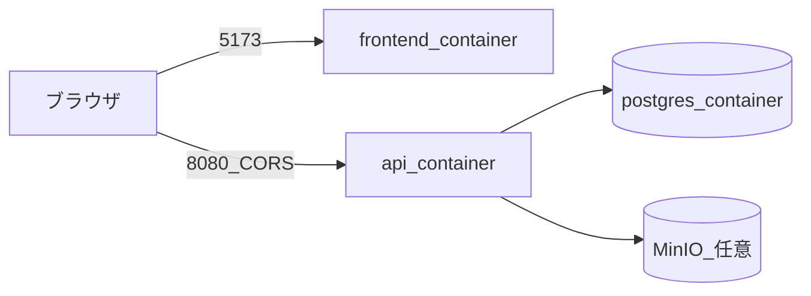
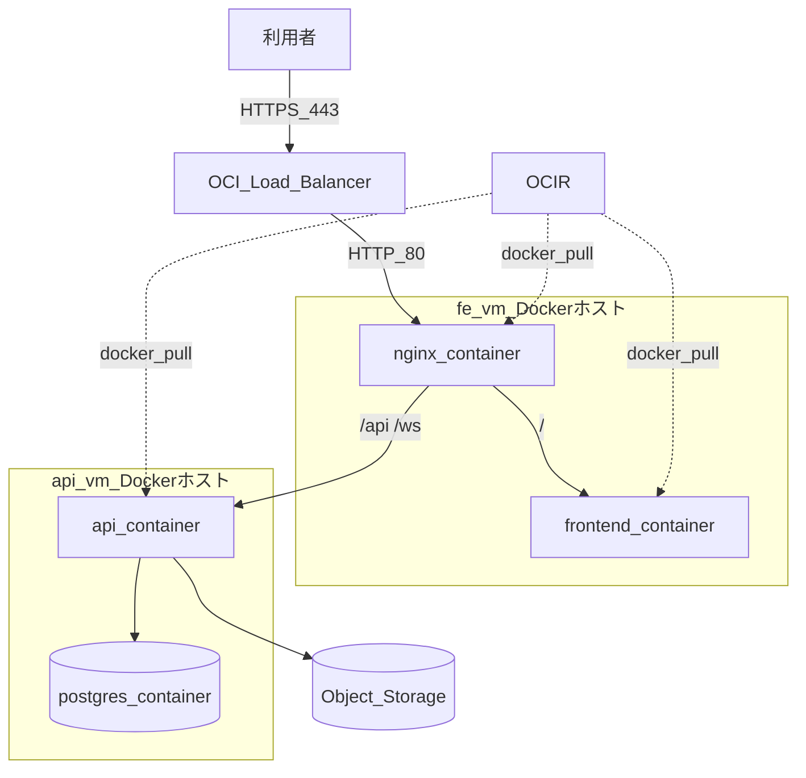
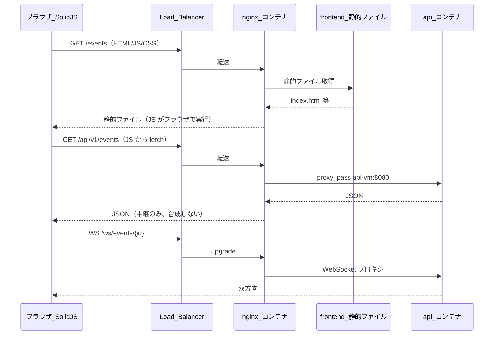
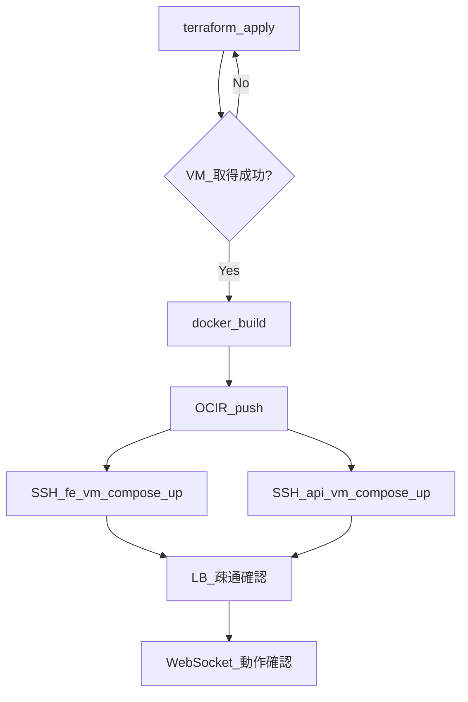

# システム構成

本ドキュメントは **アプリケーション構成** と **OCI インフラ**（LB、Docker、OCIR、cron、Terraform、Object Storage）を一体で記載する。

## 1. 3 層アーキテクチャ

```mermaid
flowchart TB
  subgraph client [クライアント層]
    Browser[ブラウザ]
  end

  subgraph frontend [フロントエンド層]
    Solid[SolidJS_SPA]
  end

  subgraph backend [バックエンド層]
    FastAPI[FastAPI_Granian_コンテナ]
    WS[WebSocket_Hub]
  end

  subgraph data [データ層]
    PG[(PostgreSQL_コンテナ)]
    OS[(OCI_Object_Storage)]
  end

  Browser --> Solid
  Solid -->|ブラウザJSが同一オリジンへ| FastAPI
  Solid -->|WebSocket| WS
  FastAPI --> PG
  FastAPI --> OS
  WS --> PG
```



| 層 | 技術 | 責務 |
| --- | --- | --- |
| フロントエンド | SolidJS / @solidjs/router | UI、ルーティング、認証、API・WS |
| 状態 | createResource + WebSocket フック | リアルタイム反映 |
| CSS | UnoCSS | スタイル |
| バックエンド | Python / FastAPI / Granian（コンテナ） | REST、WebSocket、認可 |
| データベース | PostgreSQL（コンテナ） | 永続化 |
| オブジェクトストレージ | OCI Object Storage | イベント画像 |
| コンテナ基盤 | Docker / Docker Compose | ローカル・本番の実行環境 |
| レジストリ | OCI Container Registry（OCIR） | 本番イメージ配布 |

## 2. ローカル開発構成（Docker Compose）



ローカルでは **ブラウザ JS** が `:8080` に直接アクセス（CORS）。frontend コンテナから api へサーバー通信はしない。

| コンポーネント | ポート | 備考 |
| --- | --- | --- |
| frontend | 5173 | Vite dev（開発時）または nginx（本番 build 成果物） |
| api | 8080 | FastAPI + Granian |
| postgres | 5432（内部） | Compose ネットワーク内のみ公開 |
| minio（任意） | 9000 | Object Storage ローカル模擬 |

**想定 compose 構成（実装時）**

```
docker-compose.yml          # ローカル開発（全サービス）
docker-compose.fe.yml       # 本番 fe-vm 用（nginx + frontend）
docker-compose.api.yml      # 本番 api-vm 用（api + postgres）
```

```bash
# ローカル
docker compose up --build

# 本番 VM（イメージは OCIR から pull）
docker compose -f docker-compose.api.yml pull && up -d
```

開発時はオリジンが異なるため、API が CORS で `http://localhost:5173` を許可する。

## 3. 本番構成（OCI IaaS + LB + コンテナ）

### 3.1 初級（recipe-app）との関係 — 「移行」ではない

初級（recipe-app）の実態と本アプリの関係を整理する。

| 項目 | 初級（recipe-app） | 本アプリ（event-app） |
| --- | --- | --- |
| 想定 VM | Ampere A1 Flex（在庫があれば） | Ampere A1 Flex × 2（fe + api） |
| 在庫不足時の実態 | **E2.1.Micro（x86）1 台** にフォールバック | cron で Ampere 取得を待つ |
| Always Free 枠 | x86 Micro と Ampere A1 は **別カウント** | Ampere 合計 2 OCPU / 12 GB から 6 GB 使用 |

**Micro を destroy しても Ampere の空き容量には直接つながらない。** 初級 destroy の意味は次の 2 点に限られる。

1. **同時公開しない**（URL・運用の整理）
2. **x86 Micro 枠**（最大 2 台）を空ける — 本アプリが Ampere を取れない場合の予備ではない

| 手順 | 内容 |
| --- | --- |
| 1 | （任意）recipe-app `terraform destroy` — Micro 等の削除 |
| 2 | cron / 手動で本アプリ `terraform apply` — **Ampere fe-vm / api-vm を新規作成** |
| 3 | イメージを OCIR に push |
| 4 | fe-vm / api-vm で `docker compose up -d` |

Ampere が取れない間は本アプリの apply も失敗しうる。初級の存在有無とは独立した問題。

### 3.2 大阪リージョンと cron リトライ

| 項目 | 内容 |
| --- | --- |
| ホームリージョン | `ap-osaka-1` |
| 課題 | Ampere A1 容量不足（Out of host capacity） |
| 対策 | Mac 上 cron で `terraform apply` を定期実行 |
| 参考 | recipe-app `infra/deploy/hourly-cron-apply.sh` を移植 |

```bash
0 * * * * /path/to/event-app/infra/deploy/hourly-cron-apply.sh # event-oci-hourly-retry
```

### 3.3 OCI Always Free リソース配分

| リソース | 配分 | Always Free |
| --- | --- | --- |
| fe-vm（Docker ホスト） | 1 OCPU / 3 GB | Compute |
| api-vm（Docker ホスト） | 1 OCPU / 3 GB | Compute |
| Load Balancer | Flexible LB 1 基 | ○ |
| Object Storage | Standard 20 GB 以内 | ○ |
| Container Registry（OCIR） | 500 リポジトリ / ストレージ枠内 | ○ |
| **Compute 合計** | **2 OCPU / 6 GB** | |

### 3.4 構成図（本番・コンテナ）



| VM | コンテナ | 役割 |
| --- | --- | --- |
| fe-vm | nginx, frontend | 静的 SPA 配信、`/api` `/ws` を api-vm へプロキシ |
| api-vm | api, postgres | FastAPI + WebSocket + DB |

ブラウザ → LB → fe-vm nginx コンテナ → api-vm api コンテナ。PostgreSQL は api-vm 内のコンテナ（volume 永続化）。

### 3.4.1 DB の置き方（2 VM / 3 コンテナ構成）

**結論: PostgreSQL は api イメージに含めず、api-vm 上の別コンテナとして動かす。Compute インスタンスは 2 台（fe-vm + api-vm）。**

| パターン | 構成 | 本次 |
| --- | --- | --- |
| A. API コンテナに DB 同梱 | 1 コンテナに FastAPI + PostgreSQL | **不採用**（プロセス分離・バックアップ・再起動が困難） |
| B. api-vm 上で Compose | api コンテナ + **postgres コンテナ**（同一 VM） | **採用** |
| C. DB 専用 VM | fe-vm + api-vm + **db-vm** の 3 インスタンス | **不採用**（Always Free 2 OCPU / 12 GB では 3 VM は非現実的） |

```
fe-vm（1 OCPU / 3 GB）
├── nginx コンテナ
└── frontend コンテナ

api-vm（1 OCPU / 3 GB）
├── api コンテナ      ← FastAPI / WebSocket のみ
└── postgres コンテナ ← PostgreSQL 専用（Docker volume で data 永続化）
```

- **api コンテナと postgres コンテナは別**。api の Dockerfile に PostgreSQL は入れない。
- 5432 は Compose 内部ネットワークのみ。インターネット / fe-vm からは直接触れない。
- Always Free の都合で **Compute は 2 台** が上限に近い。DB 用に 3 台目は取らない。

### 3.4.2 マネージド DB を使わない理由

**マネージド DB** とは AWS の **RDS** のように、パッチ適用・バックアップ・可用性をクラウド側が担うデータベース専用サービスのこと。OCI には次がある。

| OCI サービス | AWS 相当 | Always Free | 本次 |
| --- | --- | --- | --- |
| **OCI Database with PostgreSQL** | RDS for PostgreSQL | **なし（有料）** | 不採用 |
| **Autonomous Database** | （Oracle 専用 RDS 的） | **あり**（2 インスタンス） | 不採用（Oracle DB であり PostgreSQL ではない） |
| **MySQL HeatWave** | RDS for MySQL 的 | **あり**（50 GB） | 不採用（本アプリは PostgreSQL 前提） |
| **postgres コンテナ on api-vm** | EC2 上に自前 PostgreSQL | Compute 枠内 | **採用** |

PostgreSQL を **無料のマネージド** で使う選択肢は OCI Always Free にはない。Autonomous / MySQL HeatWave は無料だが DB エンジンが異なるため、スキーマ・SQL・ドライバを作り直す必要がある。コストと PostgreSQL 前提を優先し、**api-vm 上の postgres コンテナ** とする。

### 3.4.3 フロントとバックの通信経路（誰が誰に聞いているか）

構成図だけ見ると nginx が FE / BE 両方に矢印を向けていて、**nginx が両方の結果を合成して返す**ように見える。実際はそうではない。

**本番の流れ**



| 通信 | 実際の経路 |
| --- | --- |
| 初回ページ読込 | ブラウザ → LB → **nginx** → frontend コンテナ（または nginx が配る静的ファイル） |
| REST / WebSocket | **ブラウザ上の JS** → LB → **nginx** → **api-vm の api コンテナ** |
| frontend → api コンテナ直接 | **しない**（本番）。fe-vm と api-vm は別ホスト |
| nginx の役割 | 同一オリジン（`https://example.com`）の入口。**`/api` `/ws` を api-vm に中継**するリバースプロキシ |

- **frontend コンテナ**はビルド済み JS/CSS/HTML を置くだけ。サーバー側から API を呼ばない（SSR なし）。
- **SolidJS の fetch / WebSocket** はブラウザが `/api/...` `/ws/...` に向ける。URL は nginx のホスト名（= LB のドメイン）と同じオリジン。
- nginx はレスポンスを「がっちゃんこ」しない。`/api` は api だけ、`/` は静的ファイルだけ返す。

**ローカル開発**はオリジンが 2 つ（`:5173` と `:8080`）なので、ブラウザ JS が **直接** api コンテナへ CORS 付きでアクセスする。nginx は本番用。

### 3.4.4 OCI サービスの位置づけ

| サービス | AWS 相当 | 何をするものか |
| --- | --- | --- |
| **Object Storage** | **S3** | 画像などのオブジェクト保存。バケット + 公開 URL |
| **OCIR** | **ECR** | Docker **イメージの保管場所**（レジストリ）。デプロイそのものではない |
| **Compute VM + Docker** | EC2 + Docker | OCIR から `docker pull` し、VM 上でコンテナを起動 |
| **Load Balancer** | ALB | HTTPS 入口。fe-vm nginx へ転送 |

**OCIR は「IaaS のコンテナデプロイ機能の名前」ではない。** イメージを push/pull する **コンテナレジストリ**。実際の起動は Compute VM 上の Docker Compose が行う。OCI には Container Instances（VM なしでコンテナ起動）もあるが、本次は LB + 2 VM 構成のため **Compute + OCIR + Compose** を採用する。

### 3.5 Load Balancer

| 役割 | 説明 |
| --- | --- |
| SSL/TLS 終端 | 証明書を LB に配置 |
| エントリポイント | 公開 URL を LB に集約 |
| WebSocket | Layer 7 で Upgrade を fe-vm へ転送（nginx が api-vm へプロキシ） |

### 3.6 OCI Container Registry（OCIR）

| 項目 | 設計 |
| --- | --- |
| 用途 | 本番用 Docker イメージの保管 |
| リポジトリ例 | `event-frontend`, `event-api`, `event-nginx` |
| 認証 | VM から `docker login`（Auth Token） |
| デプロイ | `docker compose pull && docker compose up -d` |
| Always Free | ホームリージョンで無料枠あり |

**CI/CD イメージ（実装時）**

```bash
docker build -t ${REGION}.ocir.io/${NS}/event-api:${TAG} ./backend
docker push ${REGION}.ocir.io/${NS}/event-api:${TAG}
ssh api-vm 'cd /opt/event-app && docker compose pull && docker compose up -d'
```

### 3.7 Object Storage

| 項目 | 設計 |
| --- | --- |
| バケット | `event-app-images-prod` |
| 公開 | 読み取りのみパブリック |
| 書き込み | api コンテナから SDK（環境変数で認証） |

### 3.8 ネットワーク

| 通信 | 方針 |
| --- | --- |
| LB: 443 | 利用者 |
| fe-vm: 80 | LB のみ |
| api-vm: 8080 | fe-vm プライベート IP のみ |
| api-vm: 5432 | api コンテナ → postgres コンテナ（Compose 内部） |
| SSH: 22 | 管理者 IP のみ |

## 4. 他ユーザー更新の同期方式（WebSocket）

同時接続が **少ない前提**（イベント 1 件あたりおおむね 10 人以下）では **WebSocket が適切**。

| 方式 | 少人数向け | 本次 |
| --- | --- | --- |
| **WebSocket** | 接続 N 本は維持するが、N が小さいうちはポーリングより無駄が少ない。プッシュ即時 | **採用** |
| ポーリング | 接続は軽いが、変更がない時間も定期リクエストが発生 | 不採用 |
| SSE | サーバー→クライアント一方向。チャット投稿は別途 REST | 将来検討 |

**WebSocket を選ぶ理由（少人数）**

- 10 秒ポーリング × 10 人 = 毎秒 1 回の HTTP リクエストが **常に** 発生する
- WebSocket 10 接続のメモリコストの方が、上記ポーリングより小さいことが多い
- コメント・参加表明の **即時反映** が自然

**N が大きくなった場合:** Redis Pub/Sub + 複数 api コンテナ、または SSE への移行を検討。

| 項目 | 初版 |
| --- | --- |
| 実装 | FastAPI WebSocket + インメモリ ConnectionManager |
| スコープ | イベント ID ごとのルーム |
| 配信 | Event PUT / Comment POST / Participation PUT 成功後に broadcast |
| 切断 | クライアント側で指数バックオフ再接続 |

## 5. Terraform（IaC）

### 5.1 管理対象

| リソース | 目的 |
| --- | --- |
| VCN / Subnet / NSG | ネットワーク |
| Compute × 2 | Docker ホスト（fe-vm / api-vm） |
| Load Balancer | HTTPS 入口 |
| Object Storage Bucket | 画像 |
| OCIR リポジトリ | コンテナイメージ（Terraform または手動作成） |

### 5.2 管理外

| 項目 | 理由 |
| --- | --- |
| Docker イメージの中身 | CI / `docker build` |
| compose ファイルの env 値 | `.env`（Git 管理外） |
| PostgreSQL データ | Docker volume（ランタイム） |

### 5.3 ディレクトリ構成（予定）

```
infra/
  terraform/
    modules/
      vcn/
      compute/
      load_balancer/
      object_storage/
    environments/
      intermediate/
  deploy/
    hourly-cron-apply.sh
    deploy.sh              # OCIR push + compose up
    docker-compose.fe.yml
    docker-compose.api.yml
backend/Dockerfile
frontend/Dockerfile
nginx/Dockerfile
docker-compose.yml         # ローカル開発
```

## 6. デプロイフロー



| 段階 | コマンド例 |
| --- | --- |
| ビルド | `docker compose build` |
| プッシュ | `docker push ${OCIR}/event-api:tag` |
| 本番起動 | `docker compose -f docker-compose.api.yml up -d` |
| マイグレーション | api コンテナ内 `alembic upgrade head`（起動時 entrypoint でも可） |

## 7. バックアップ

| 対象 | 方法 |
| --- | --- |
| PostgreSQL | `docker compose exec postgres pg_dump` → Object Storage |
| Docker volume | pg_dump を主とし、volume snapshot は任意 |
| OCIR イメージ | タグ付きで履歴保持 |

## 8. 監視・ログ

```bash
docker compose logs -f api
docker compose logs -f nginx
```

- LB ヘルスチェック: fe-vm nginx `/health`
- api コンテナ: `/health` エンドポイント

## 9. HTTPS

LB で TLS 終端。fe-vm nginx までは HTTP（VCN 内）。

## 10. 将来拡張

| 項目 | 方向性 |
| --- | --- |
| api 水平拡張 | LB + 複数 api コンテナ + Redis Pub/Sub |
| OKE | Always Free 枠を超える場合 |
| CI/CD | GitHub Actions → OCIR push → deploy.sh |
